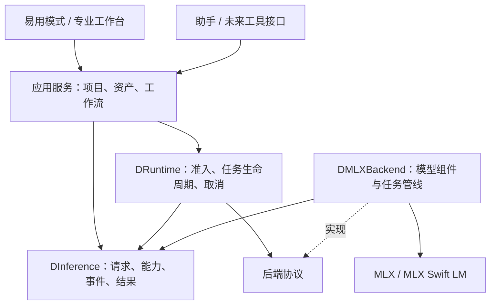

# D 架构研究与推理框架基线

**日期：2026-09-06 · 面向：D 的产品发起人与后续开发协作者**

依据用户最新定位、[原愿景](history/ORIGINAL_VISION.md)、[旧技术规划](history/PROJECT_PLAN_2026-02-25.md)、[旧协作指南](history/PROJECT_GUIDE_2026-02-25.md)、当前仓库，以及 Swift、MLX、ComfyUI、Diffusers、llama.cpp 官方资料。目标是建立可持续的原生 Mac 专业 AI 创作工作站；本报告不进行模型效果排名或完整竞品评测。

## 直接结论

**模块化值得保留，当前的独立仓库拆分和部分抽象则超过了实际需要。并发问题应通过明确的状态所有权与任务生命周期解决，不靠继续拆库。**

我建议采用“模块化单体”：一个主仓库、一份新核心内部 package、少数有清晰依赖的 targets。原生 MLX 保持主要推理后端。用户界面、项目文档、工作流与助手围绕同一组能力接口建设。通过一个可运行、可测试的切片逐步替换旧实现，不再从零重写全部项目。

本轮已经建立并验证纯 Swift 6 的推理契约与串行运行时。**原应用仍使用旧后端，新框架尚未承担真实模型推理**；不能据此宣称原有取消、下载和图像生成问题都已解决。

## 1. 为什么之前拆库有帮助，却没有解决根本问题

旧方案确实带来了正面作用：文件职责更清楚，UI 与部分推理代码分开，依赖关系显式化，也减少了把整个工程放在默认 MainActor 上的混乱。因此，之前的努力不是白费。

但三个概念需要分开：

| 边界 | 能提供的保证 | 不能提供的保证 |
| --- | --- | --- |
| Swift target/module | 导入关系、可见性、编译边界 | 不会自动隔离线程或模型状态 |
| Swift package / Git仓库 | 依赖管理、版本与独立发布 | 不会让共享对象线程安全 |
| actor / 执行所有者 | 可变状态隔离；配合许可管理完整任务 | actor的await仍允许重入；不提供进程崩溃隔离 |

SwiftPM 本身允许一个 package 包含多个 target，每个 target 编译为模块。因此无需为每个逻辑模块都维护独立仓库。[SwiftPM Package 文档](https://docs.swift.org/package-manager/PackageDescription/PackageDescription.html)

现在六个子模块随一个应用演进，没有体现必须独立发布的需求，却需要协调七个Git仓库、多个manifest与锁文件。`AIAssistant` 还是空包，说明部分结构比实际功能先走了很远。推荐最终合并管理，但先保留旧子模块历史和可构建基线，逐能力迁移。

## 2. 当前架构的具体问题

以下是代码事实，区别于对过往故障的推测。

**空抽象没有解除耦合。** `ModelContainerProtocol` 不定义任何能力，`LLMChatService` 收到后仍必须强转成 `ModelContainerWrapper`，失败就fatalError；UI又直接持有具体 `LLMChatService`。这增加了包装层，却没有形成可替换契约。

**“基础层无外部依赖”未实现。** `Core/Package.swift` 依赖MLX，`LoadedTensor`公开MLX类型。因此需要一层真正只包含普通值和服务接口的公共契约。

**不受保护的共享session。** `LLMChatService` 被标成 `@unchecked Sendable`，每次generate都创建Task并写同一个session的参数。锁定MLX LM 2.30.6的ChatSession明确要求同一session同时只由一个任务使用；当前官方源码仍有这一约束。`let session`只固定引用，不使session内部状态不可变。[官方 ChatSession 固定源码](https://github.com/ml-explore/mlx-swift-lm/blob/e3d4a20e9e20e7b8ab39aded7bbfad4ae22c9438/Libraries/MLXLMCommon/ChatSession.swift#L145)

**生命周期缺少统一所有者。** 文本和图像包装各自创建非结构化Task，外层取消未完整连接内层。图像错误被直接finish吞掉。ModelLoadingActor在检查缓存后await加载，未登记正在加载的任务，可能重复加载。这里是静态可见的风险，没有在本轮复现历史竞态。

旧指南“Actor公开方法全部nonisolated”“所有Module加unchecked Sendable”的规则应废止。正常跨actor调用可以用await；unchecked声明是开发者承担正确性责任，不是编译器给予安全保证。[Swift并发迁移指南](https://www.swift.org/migration/)

结论是：**当前同时存在不必要的包装和缺失的运行控制。**应减少前者，把精力放在取消、清理、错误、兼容性和测试上。

## 3. “tokens进、tokens出”应怎样落成接口

这句话表达的核心意图成立：引擎专心推理，外围产品能力不要侵入数值计算。但把所有输入输出字面统一成token，会限制图像创作。

ComfyUI 区分 IMAGE、LATENT、MASK、AUDIO、CONDITIONING、NOISE与采样器等数据；它们不仅是不同数字数组，还包含空间、时间、布局或采样语义。D应保留这种类型信息，而不是用隐藏字段或任意类型字典绕回来。[ComfyUI 数据类型](https://docs.comfy.org/custom-nodes/backend/datatypes)

建议的公共表达是：

> 明确类型的推理请求 + 模型/输入资源引用 → 执行事件 + 明确类型的结果 + 可等待的终态。

文本后端内部可使用tokens；扩散后端内部可使用latents和tensor。普通应用层不应拿到MLXArray、ChatSession或需要跨线程维护的裸模型对象。较大的图像结果和预览使用资源引用，避免控制接口复制整幅图像。

初版text/image两类请求用于验证边界，不意味着专业工作流只能“一次提示词生成”。将来根据实际编辑用例增加图像、蒙版、LoRA、ControlNet、组件句柄，且定义类型兼容规则。**用户可编辑的创作工作流图，与模型内部的数学计算图是两个层次。**

Safetensors解决张量存储与读取，不能单凭文件扩展名获得任意架构的执行能力。模型兼容性应来自已验证后端的能力声明。[Safetensors 文档](https://huggingface.co/docs/safetensors/index)

## 4. 推荐的总体结构

图中箭头同时表达调用/依赖方向；Runtime只知道后端协议，具体后端由应用装配时注入。未来助手通过应用服务操作项目，普通生成也可无界面直接调用runtime。

| 建议模块 | 高内聚职责 | 不应混入 |
| --- | --- | --- |
| DInference | 类型契约、模型引用、任务能力、错误、事件 | MLX、UI、下载器 |
| DRuntime | 请求准入、FIFO、运行许可、预算、取消与结束 | tokenizer、扩散公式、项目编辑 |
| DMLXBackend（后续迁入） | 模型适配、组件装配、真实生成、GPU/缓存生命周期 | 窗口、聊天面板、下载界面 |
| Workbench（后续整合） | UI与应用服务、项目/资产、历史撤销、预设与助手入口 | 持有裸模型或直接改变推理session |

这是长期职责方向，不是要求立即创建四个大库。Workbench内部先用目录区分服务和视图；当有独立测试/复用需求再拆target。当前只创建前两个有真实职责的模块。

harness负责“做什么、用哪些资产、怎样组织和记录”；后端负责“一次推理怎样正确执行”；runtime负责“现在能否运行、谁占用资源、何时真正结束”。统一资源所有权不意味着所有东西都塞入一个庞大的Coordinator。

## 5. 优秀经验：借鉴什么，暂不照搬什么

| 参考 | 对D有用的经验 | 当前不照搬 |
| --- | --- | --- |
| ComfyUI | 有类型的数据流；工作流能脱离界面执行；提交校验、队列、中断、事件 | 所有节点/自定义插件生态、完整动态DAG、任意Comfy workflow兼容承诺 |
| Diffusers | 按任务组成pipeline，复用编码器、denoiser、VAE、scheduler | 复制全部Python实现或为每个步骤先创建Swift库 |
| llama.cpp server | 推理状态有明确所有者；请求/结果与外部协议分开；集中调度 | 多用户slot、batching和HTTP服务作为桌面首版前提 |
| MLX Swift LM | 使用官方模型容器和已验证实现；遵守session/cache所有权 | 通用unchecked包装或基于旧文档重写一遍LLaMA |

ComfyUI官方描述了服务端执行与客户端界面的分离，并提醒依赖界面交互的节点不适合直接API执行。D的简单模式、专业模式和助手因此应调用同一命令路径。[ComfyUI 节点概览](https://docs.comfy.org/custom-nodes/overview)、[服务端路由](https://docs.comfy.org/development/comfyui-server/comms_routes)

Diffusers用任务管线组合多个组件，而不是要求一个“万能模型”接受所有参数；这与D的可插拔方向相容。[Diffusers Pipeline](https://huggingface.co/docs/diffusers/using-diffusers/loading)

llama.cpp的server文档把推理context、任务队列和执行slot分开，并强调尽早转换为原生类型。D可借鉴状态所有权和类型边界，无需把桌面软件先做成服务器。[llama.cpp server架构](https://github.com/ggml-org/llama.cpp/blob/9e0e220594af405a62835dc3a27495729fd8506b/tools/server/README-dev.md#L39)

本轮借鉴设计，没有复制上述项目源码或增加其运行依赖。

## 6. 并发、取消与内存应先定下的规则

1. **先串行，再以测量决定并行。**初版整个新runtime只给一个重推理任务许可，包括模型准备和清理。actor在await时可重入，因此需要显式activeRunID。这是当前产品/设备策略，并非MLX绝对不能并行。
2. **停止有完成语义。**取消只是请求；execute必须取消并等待内部工作，release完成后才能通知终态及放行下一任务。UI应区分“正在停止”和“已停止”。
3. **输出不能静默丢失。**本轮采用有界缓冲；满时明确失败而非悄悄漏掉文本。后续可引入背压或累计快照，但不能用无限缓冲掩盖问题。
4. **估计与保证分开。**预算准入拒绝明显过大的请求；后端必须报告包含权重、缓存、工作区的估计。准入不是OOM保证，还需实际测量峰值、系统压力和MLX行为。
5. **对象不越界，清理不缺席。**后端独占session/kv/cache；每次运行异常、部分加载和取消都必须清理。当前无长期驻留缓存，后续需连同预算一起设计。
6. **关闭时先停止接收。**shutdown先关闭admission，再等待已接收任务取消/清理，避免边关边接新任务。

D锁定版本与最新上游的取消实现存在差异：新main明确取消内部generation task，旧2.30.6对应位置只等待其结束。迁入真实后端前需要验证取消延迟，不能认为给外层流加onTermination就完成全部工作。[官方当前取消实现](https://github.com/ml-explore/mlx-swift-lm/blob/e3d4a20e9e20e7b8ab39aded7bbfad4ae22c9438/Libraries/MLXLMCommon/ChatSession.swift#L1356)

## 7. 本轮框架实际落地

- 根目录 `Package.swift`：一个主仓库内部package，两个targets，零远程依赖，Swift6模式。
- `Sources/DInference`：text/image请求、能力和模型引用、输出/资产、结构化错误、run handle、后端协议。
- `Sources/DRuntime`：有界FIFO、单任务许可、内存估计准入、显式取消、清理后终态、关闭admission。
- `Tests/DRuntimeTests`：受控backend与actor gate的确定性测试；测试替身只在Tests目录存在。
- `scripts/test-foundation.sh`：构建与测试缓存、日志默认放外盘。
- `docs/history`：三份旧材料原文归档；`AGENTS.md`更新当前协作方式；两个ADR记录边界和生命周期。

这个框架的作用是先把正确的运行规则变成可执行、可回归的代码。它没有注册假模型，也没有给应用展示模拟生成结果。旧MLX服务、图像路径和UI尚未迁入，原有包仍是应用基线。

## 8. 接下来如何迁移而不再次失控

| 阶段 | 工作 | 必须看到的证据 |
| --- | --- | --- |
| 已完成的框架阶段 | 定义契约与运行时，测试状态与取消 | Swift6编译、生命周期回归、旧应用构建不回退 |
| 首个真实MLX切片 | 一个兼容模型、一个session所有者、真实cancel/drain/release | 可生成；中途取消后底层停止；重复运行不持续涨内存 |
| 图像创作切片 | 一个经验证图像pipeline；图像输入或蒙版能力根据首个创作任务选择 | 固定模型/参数/输入的结果校验；错误可解释；可保存产物 |
| 应用接入 | 手动UI和助手调用统一应用命令 | 同任务记录、同错误、同结果；停止/恢复体验一致 |
| 结构收敛 | 把已迁移源码纳入主仓库，移除失效wrapper/manifest/空包 | 新检出可构建；依赖单向；保留历史与可回退点 |
| 再提炼工作流 | 从2—3条真实工作流提取公共步骤与资源句柄 | 复用确实减少重复且未损失专业控制 |

文本切片适合便宜地验证框架，但不代表把D重新定位为聊天软件。产品验证必须很快回到图像等实际创作任务。

为了成熟商品，需要长期跟踪“加载失败怎么解释、取消多久结束、内存会不会失控、结果是否丢失、操作是否可恢复”。这些验收比有多少模块、模式或插件更直接。

## 9. 已验证与未验证

本机验证：Swift 6.3.3 / Xcode 26.6；新核心16项Swift Testing测试全部通过；原D应用Debug arm64构建成功。独立代码审阅发现的“旧句柄取消复用ID的新任务”与“关闭时仍接收任务”均已修复并有回归测试。新源码导入依赖与文档链接已检查，未使用unchecked Sendable或nonisolated(unsafe)。独立测试缓存放在外盘同级BuildCaches/D-Foundation后，无原先的调试符号缓存路径警告；日志仍在D-Development/Logs。

验证日志位于同级D-Development/Logs；测试实现位于Tests/DRuntimeTests。没有运行真实MLX模型或Thread Sanitizer；确定性测试证明协议在受控后端下的行为，不能证明未知后端遵守协议。

架构事实来自当前源码和上游资料；模块数量、迁移顺序与单通道策略是针对D的工程判断，不是唯一正确模式。

本轮不升级锁定依赖、不做推理速度承诺、不验证全部模型兼容、不测试真实GPU取消或量化/全精度差异。统一内存16GiB是当前设备约束，外盘容量不改变它；大型模型与out-of-core应有独立实验，不成为首版前置条件。

相同seed不保证跨设备和依赖版本逐像素一致；最终运行记录还要包含模型/适配器版本、参数和输入资产。当前框架的revision字段只是记录能力，不会自动计算或校验文件摘要。[Diffusers 可复现性说明](https://huggingface.co/docs/diffusers/using-diffusers/reusing_seeds)

本报告的研究与源码结论已收敛，未来最有价值的新证据来自真实模型与创作流程的集成验证。来源版本与访问记录保存在docs/research，不将main分支文档等同于当前锁定依赖。
