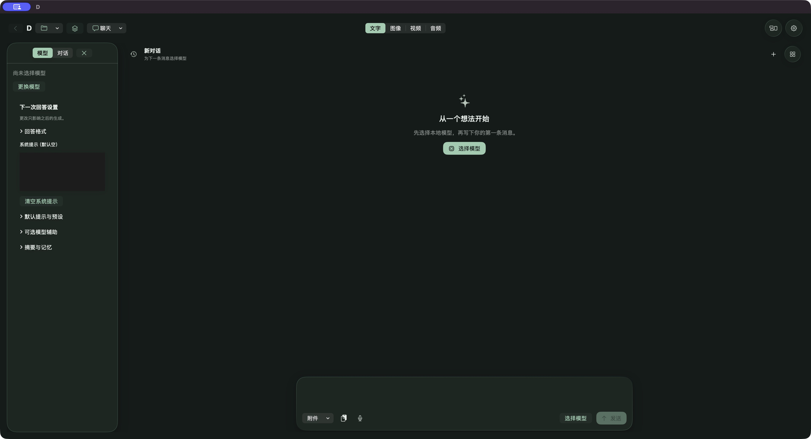

# D 原生 UI 内容折射镜片与增强回弹

2026-10-10 · **UI-PRESENTATION-REBUILD-01**。当前候选 **ad50e57f**：分类选中镜片已从不透明plate/复制文字改为对唯一分类内容的真实像素折射，透明处直接透出现有应用分类栏，不采样桌面。仍只有一枚镜片，hover只改文字。回弹加强至前版阻尼对应的幅度，目标前速度曲线和180–220毫秒总时长保持。这是自定义应用内容镜片，不冒称苹果系统Liquid Glass，也未推广到所有浮层。详见[当前行动](CURRENT_ACTIONS.zh-CN.md)和[任务末节](tasks/UI-PRESENTATION-REBUILD-01.md)。

## 唯一推荐入口

当前已运行本版，可直接查看。原入口原位更新，仍拒绝已有D时双开：

`/Volumes/CodexProjects/Codex/D-Development/AgentTrials/D-RELEASE-FREEZE-01/run-20261004T145523Z-continuous-closeout/delivery/启动聊天当前验收.command`

指向 `/Volumes/CodexProjects/Codex/D-Development/AgentTrials/UI-PRESENTATION-REBUILD-01/run-20261010-local-refraction/delivery/D UI Review ad50e57f.app`。

生产代码 **ad50e57f5fe51be481dcb5ec7a3c972eefd568dd**。最终12项定向检查通过；普通构建27.73秒，独立包签名/App Sandbox及5文件（含镜片shader）摘要一致。隔离会话仍为 `E6657FC1-65D2-4860-997C-8A0D531CAB07`，源/main未推进。

Lead已亲见同版浅深原生界面、首末选项镜片和最小宽度双栏；左右圆钮外缘、连续点击后的收展/隐藏及视频按钮文字外留白成功。原图在`run-20261010-local-refraction/gui`：`01-native-light.jpg`、`02-native-light-end.jpg`、`03-native-dark-start.jpg`、`04-native-light-hover.jpg`。外观已恢复跟随系统，强度100%对应220毫秒，候选停在视频双栏、未加载模型。

重点复看：镜片穿过分类文字时的折射/通透，以及约200毫秒的回弹强度。系统录屏工具打开一次超时，已停止该路径；没有连续录像/逐帧时长，原生终态不算完整动态验收。原聊天已删除路径未动，输入/Undo/阅读/拖入等旧门槛保留；旧输入最右2点接收器失败不因圆钮边缘通过关闭。证据在`lead/native-sequence.json`。

## 旧首片原生参考（a226，非本版截图）

证据根R为 `/Volumes/CodexProjects/Codex/D-Development/AgentTrials/UI-PRESENTATION-REBUILD-01/run-20261008-first-slice`。

打开 `R/delivery/原生UI首片评审.html` 查看完整原图与明确标注差异的参考。图像字节来自原生截图，没有重绘；原始工具返回JPEG，保留早期.png证据名，同时提供正确.jpg别名。

已实际看到空输入紧凑、选择模型清楚、单一顶部分类与模式入口。短草稿Undo清空、Redo恢复；半屏30行输入仅内部滚动，附件/语音/选择模型/发送操作行可见。原生输入器与服务接线保留，后端/存储/模型不改。

旧图中的系统提示黑框、缺少占位文案和模型层级弱已在96d6代码中局部改善；052f本轮聊天原图可见透明主题系统提示框和输入占位，但处于已删除路径，不是可编辑草稿验收。原型01-chat为浅色双栏有消息，07-dark/09-narrow为图像页，均不能冒充本轮同状态聊天对照。交付的聊天HTML仅对齐主题/栏/消息/草稿，保留原样式；原型仍有Qwen演示模型，原生未选模型，且派生页本轮未渲染。**严格同状态对照仍待补。**

## 保留现场与后续门槛

旧-3812参数错误、曾明确报告锁屏、R6的-3811捕捉流失败分别保留。R7和R8桌面成功，本轮无旧D进程时才启动ad50e57f；不改写前轮未验状态，不双开或丢弃现有工作。

继续时用文件→打开项目，选择独立副本：

`R/gui/UI review.dproject`

它带24节合成长文与受控媒体展示记录，`text:fixture`不是可运行模型。c978中间包已实际打开此副本；a226最终包尚未完成它的冷重开。不要把这些夹具写成模型生成成果。

当前优先待验：本版内容折射与增强回弹的用户观感、连续动效；其余主体边缘点击、Escape/分类键盘焦点与菜单隔离/拖出/禁用、短长草稿原生回归；再顺路补同状态对照、右栏/焦点缩窗、浅色/大字/轻量、长文分类/模式往返、Finder附件→预览→保存冷开、已有Qwen短请求/停止及公共模态导航。模型文件已存在而本轮未登记/执行；不下载新模型。旧fit/封装/端口与viewport失败沿用原记录，见[集中队列](FAILURE_AND_PERMISSION_AUDIT.zh-CN.md)。

## 同树 Xcode Run

打开 `/Volumes/CodexProjects/Codex/D-Worktrees/D-UI-PRESENTATION-REBUILD-01/D.xcworkspace`，选 **D Nodes / My Mac / Debug**。本轮普通构建已通过，未实际点击Xcode Run。

忽略的本机 `Development/Development.local.xcconfig` 仅指定已有开发资源：

`/Volumes/CodexProjects/Codex/D-Development/AgentTrials/D-RELEASE-FREEZE-01/run-20261004T041401Z-chat-resume/delivery/resources-with-python`

不修改签名/系统权限或重复下载。换机说明见[Development](../Development/README.md)。旧79f试用页固定存档见[历史索引](history/README.md#ui-presentation-takeover)。
