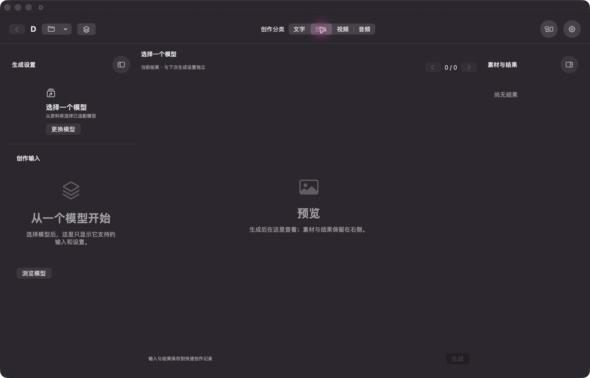

# D 开发候选：原生界面第一版

2026-10-08 · **UI-REFINEMENT-01组合原生验收未完成**。代码/非交互检查与普通签名构建已完成，桌面再次锁屏后暂停窗口测试。新包不替换普通D、不接纳main、不作为正式发行包。详细状态见[当前行动](CURRENT_ACTIONS.zh-CN.md)及[任务证据](tasks/UI-REFINEMENT-01.md)。

## 唯一推荐试用入口

继续双击原有入口（已经原位指向新候选）：
`/Volumes/CodexProjects/Codex/D-Development/AgentTrials/D-RELEASE-FREEZE-01/run-20261004T145523Z-continuous-closeout/delivery/启动聊天当前验收.command`

本次只打开：
`/Volumes/CodexProjects/Codex/D-Development/AgentTrials/UI-REFINEMENT-01/run-20261007T184130Z/delivery/D Native UI baf91280.app`

代码 **baf9128093fa214bf4ddf340331390331d9873dc**；普通签名构建33.70秒通过，复制关键文件一致、签名验证通过，没有手补。该最终包尚未原生操作，不把之前bb6窗口或fccf测试当它已通过。

入口使用独立偏好`B7DA6B57-4CE1-49DF-9917-59FA18A8870F`，已有D时拒绝双开，不关闭用户应用。旧8cf功能包与入口备份保留在原位置及本轮delivery/previous-launcher.command；它们不是另一份新界面推荐入口。不要同时打开旧测试版。

## 不运行模型也能检查的试用材料

打开“文件→打开项目”，选：
`/Volumes/CodexProjects/Codex/D-Development/AgentTrials/UI-REFINEMENT-01/run-20261007T184130Z/gui/UI acceptance.dproject`

这是独立测试副本，带既有24节长文、图片、视频和音频。媒体来自已存在的固定产物；为展示写入的记录明确标注**受控媒体展示记录，不是模型执行结果**，没有假模型或新推理。未选真实模型时生成按钮不可用是预期；无需下载、登录或生成。

1. 顶部中央是文字/图像/视频/音频；右上相邻圆钮直接切换工作模式和打开设置。每侧圆钮收栏，中央回收空间；窄窗临时只展开一侧。
2. 图像/视频中央固定预览，右侧选候选；图片可放大拖动、适配复位。视频保留播放器时间轴和原音轨。长参数与来源从详情看；浏览旧结果不改下一次输入。
3. 设置包含外观、文件、网络、凭据、语言、操作与辅助。外观可分别改浅深色号、透明度、动效和轻量模式；低对比会提示，可恢复默认。网络/凭据沿原服务，不因打开设置而发起搜索，F26不在本轮办理。
4. 工作流可在原小样例或新测试图中检查指针框选/多选移动、手形平移、原删除/Undo和封装。右下适配只改变视野，不重排。不要在真实作品上试未验操作。
5. 文字页沿用当前聊天与输入组件。最终包仍需补可见外链取消、阅读恢复/Bottom以及输入区CSV左侧和右下拖放；不重复跑模型，也不默认要求本人组字或试听。

以上是待完成的实际步骤，不是已执行通过列表。桌面重新可用时由Lead先独立完成；无须现在本人操作。

## 同树 Xcode Run

打开：
`/Volumes/CodexProjects/Codex/D-Worktrees/D-UI-REFINEMENT-01/D.xcworkspace`

选择 **D Nodes / My Mac / Debug**。工作树在baf生产代码后只追加本轮说明；最终SHA见任务回执。本机忽略文件`Development/Development.local.xcconfig`复用既有签名，资源路径：
`/Volumes/CodexProjects/Codex/D-Development/AgentTrials/D-RELEASE-FREEZE-01/run-20261004T041401Z-chat-resume/delivery/resources-with-python`

正常资源阶段嵌入原引擎与ChatPython，无需手补App、重装模型或改变签名方案。命令行同树构建已通过；本次没有实际点击Xcode Run，普通GUI组合验证尚缺。换机按[开发资源说明](../Development/README.md)准备环境。

## 证据与边界

- fccf8889810a2340e0c151aa3d307cfeb27e30fa的59项/8套件通过，含外观/Markdown属性、Quick组字宿主、Canvas几何/手势门禁及原生隐藏保护。另一次原子移动与媒体Store夹具独立通过，不凑合计通过率。
- baf比上述受测组合多窄窗检查器显式展开、设置按钮文案和缩回100%居中；构建通过，最后展示变化未做窗口测试。
- 唯一现有新壳层截图如下，来自**bb6f5f1c中间版本**，不是最终主题/Canvas截图。最终四分类、设置、Canvas同版截图仍待桌面。

main与旧release候选维持91bef7d720a8b6cb923207ef787230f36496f4cf；旧8cf功能基线及其真人/模型证据保留。新候选没有修改推理路径，不重复模型生成。README中备份/独立恢复、冷启和固定自然视频的过时描述仅按已有代表证据校正，不外推全场景、干净机器、NAS或正式发行。首次使用、无权重分发/依赖封装、升级与渠道责任仍在。
