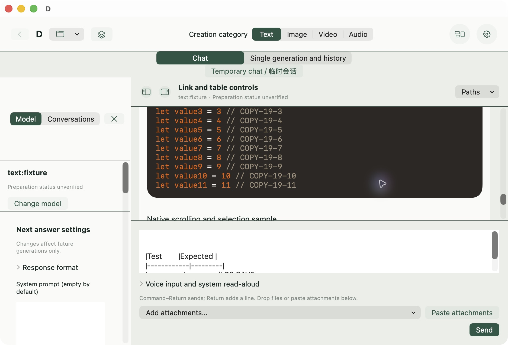
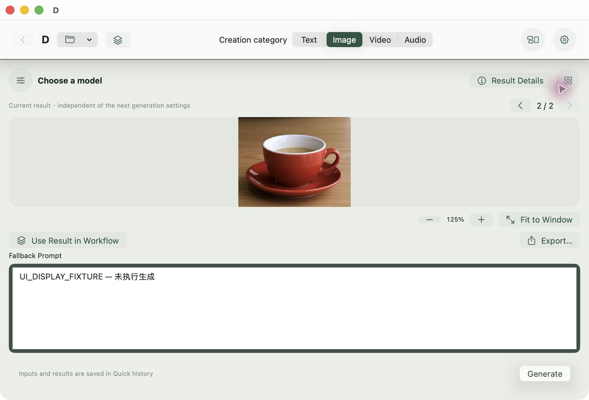
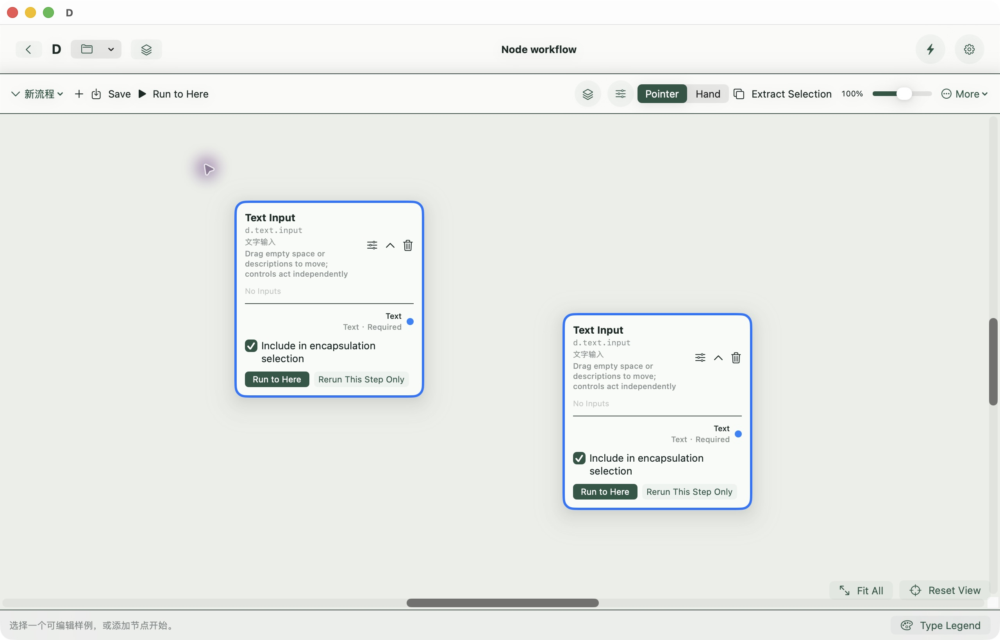

# D 开发候选：原生界面第一版

2026-10-08 · **UI-REFINEMENT-01 r2：实现已补齐，组合原生验收部分完成。** 独立候选可试用，未接纳main、未正式发行。具体已验/余项见[当前行动](CURRENT_ACTIONS.zh-CN.md)及[本轮任务](tasks/UI-REFINEMENT-01.md)。

## 唯一推荐入口

双击原入口（已原位更新）：
`/Volumes/CodexProjects/Codex/D-Development/AgentTrials/D-RELEASE-FREEZE-01/run-20261004T145523Z-continuous-closeout/delivery/启动聊天当前验收.command`

只启动：
`/Volumes/CodexProjects/Codex/D-Development/AgentTrials/UI-REFINEMENT-01/run-20261008T010729Z-no-desktop/delivery/D Native UI 02df6f1c.app`

代码 **02df6f1c11f7043c4b3f395e0c05bbab7d3c3940**。同树普通签名构建通过；4关键文件与构建产物一致且验收后未变，没有手补或重签复制包。其后候选7ae57793仅改测试驱动，最终文档SHA见外部final-receipt，不声称该App由文档提交重建。

入口使用隔离偏好`B7DA6B57-4CE1-49DF-9917-59FA18A8870F`；已有D时拒绝双开，不关闭你的App。旧8cf功能基线和历次候选保留，不是另一份推荐入口。验收结束已正常关闭本轮D和Finder窗口。

## 不运行模型的试用

通过“文件→打开项目”打开专属副本：
`/Volumes/CodexProjects/Codex/D-Development/AgentTrials/UI-REFINEMENT-01/run-20261008T010729Z-no-desktop/gui/UI acceptance.dproject`

带24节合成长文、固定图片/视频/音频和测试图。展示记录注明**受控媒体展示记录，不是模型执行结果**；没有为本轮重新生成。text:fixture不是可运行模型；未选真实模型时就绪失败/生成不可用属于夹具预期。

1. 顶部文字/图像/视频/音频筛选；右上圆钮切快速/工作流或开设置。
2. 文字左栏是模型与下一次参数，切“Conversations/会话”管理会话；右栏是资料/成果，底部仍是原输入器。面板可收起。合成长文可浏览、搜Section、点可见链接再取消；不要把文本夹具发送给模型。
3. 图像/视频固定在中央，收栏后扩展；前后按钮或右侧选择候选。图片放大/拖动/适配只改预览，视频保留时间轴/原音轨。结果详情关闭后可再开设置。
4. 画布“指针”在空白处框选，再从卡片非控件区一起移动；“手形”只平移。选端口也可点击输出再点击输入连接。删除及Undo、原有封装仍在；右下恢复视图不重排节点。
5. 齿轮与Cmd-,共享分类/目标。外观可改浅深色、背景通透、动效及轻量模式；模型参数不放在全局设置。网络/凭据只是现有服务入口，F26真实调用仍延期。

## 同树 Xcode Run

打开 `/Volumes/CodexProjects/Codex/D-Worktrees/D-UI-REFINEMENT-01/D.xcworkspace`，选 **D Nodes / My Mac / Debug**。

本机`Development/Development.local.xcconfig`沿用现有签名，资源为：
`/Volumes/CodexProjects/Codex/D-Development/AgentTrials/D-RELEASE-FREEZE-01/run-20261004T041401Z-chat-resume/delivery/resources-with-python`

正常构建阶段嵌入已有引擎，不需要手补App或重复下载。命令行同树签名构建已通过；本轮没有另点Xcode Run。换机依[开发资源说明](../Development/README.md)，本包不是已完成首次分发验证的安装包。

## 本轮真实截图

以下是本机普通签名App的原生截图，不是网页原型。全部数据为隔离夹具。

## 已验与仍需检查

- 10ee：12项纯值/路由及3项聊天hosting通过。普通App完成框选、多移一次Undo、手形、点击连线、删除恢复、封装创建、编辑Undo、Bottom和可见外链取消。02df仅标签小修，完成冷开草稿、窄窗标签、图像候选/缩放/收栏、视频到结尾及设置返回。
- 旧viewport hosting原15处失败；驱动按当前工具规则对齐后，在窗口visible/key前置失败，不能写为通过。r1的59项不累计为本版通过率。
- 新壳层Finder拖入仍无可靠自动目标命中；端口拖连未成功、点击连接已成功。封装冷开边界、分类往返精确阅读点、收栏过渡中fit、实际系统辅助偏好及大字号留待定点核验。旧真人输入/文件接收证据保留，不冒充新组合全验。
- 不需要你现在操作，不重办语音、HF、宏信任或搜索凭据。main保持91bef旧已验基线；新UI验收、功能冻结与正式发行分别判断。

证据根：`D-Development/AgentTrials/UI-REFINEMENT-01/run-20261008T010729Z-no-desktop`。`lead/native-results.json`汇总成功、未验及无效早期操作，`lead/final-receipt.json`绑定最终候选/远端版本。
